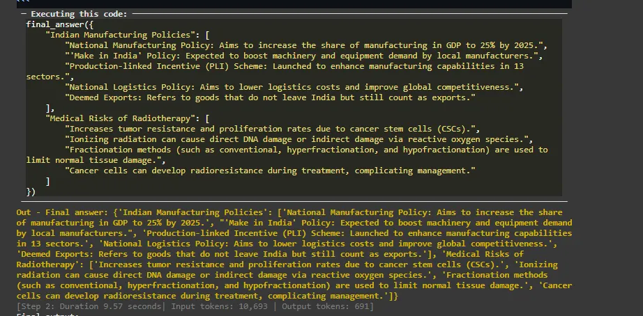

When working with domain-specific queries, we often struggle with the challenge of balancing in-domain and out-of-domain requests. But not anymore! With **embedanything**, you can leverage fine-tuned, domain-focused models while **smolagent** takes the lead in smart decision-making. Whether you're handling queries from different domains or need to combine their insights seamlessly, smolagent ensures smooth collaboration, merging responses for a unified, accurate answer.
<!-- more -->


But first let’s discuss what is SmolAgent and then we can discuss each retrieval :

According to Hugging-face’s official release agents are:

```
AI Agents are **programs where LLM outputs control the workflow**.

```

Any system leveraging LLMs will integrate the LLM outputs into code. The influence of the LLM’s input on the code workflow is the level of agency of LLMs in the system.

## An Example:

This agentic system runs in a loop, executing a new action at each step (the action can involve calling some pre-determined *tools* that are just functions), until its observations make it apparent that a satisfactory state has been reached to solve the given task. Here’s an example of how a multi-step agent can solve a simple math question:


### How it’s working with EmbedAnything

Embedanything is used to take docs from source, to inference domain specific and general models and generate embeddings. It takes care of chunking and cleaning for parsing documents.

Embed anything is a rust-based framework for the Ingestion of any file type in any modality, Inference of any model present in HF with their HF link using a candle and some Onnx models, and then indexing them to the vector database. It excels at three core functions:

1. Document Processing: Automatically handles document intake from various sources, cleaning the text and removing irrelevant content to ensure quality input.
2. Intelligent Chunking: Breaks down documents into optimal segments while preserving context and meaning, ensuring the resulting embeddings capture the full semantic value of the content.
3. Flexible Model Integration: Seamlessly works with both general-purpose language models and specialized domain-specific models, allowing users to generate embeddings that best suit their specific use case.

This streamlined pipeline eliminates the usual complexity of document embedding workflows, making it easier to prepare data for downstream tasks like semantic search, document retrieval, or content recommendation systems.


## Let’s get into the code:

```python
class RetrieverTool(Tool):
    name = "retriever"
    description = "Uses semantic search to retrieve policies about india that could be most relevant to answer your query."
    inputs = {
        "query": {
            "type": "string",
            "description": "The query to perform. This should be semantically close to your target documents. Use the affirmative form rather than a question.",
        }
    }
    output_type = "string"

    def __init__(self, directory, **kwargs):
        super().__init__(**kwargs)
        self.model = EmbeddingModel.from_pretrained_onnx(WhichModel.Bert, ONNXModel.AllMiniLML6V2Q)
        self.connection = lancedb.connect("tmp/general")
        if "docs" in self.connection.table_names():
            self.table = self.connection.open_table("docs")
        else:
            self.embeddings = embed_anything.embed_directory(directory, embedder = self.model)
            docs = []
            for e in self.embeddings:
                docs.append({
                    "vector": e.embedding,
                    "text": e.text,
                    "id": str(uuid4())
                })
            self.table = self.connection.create_table("docs", docs)

    def forward(self, query: str) -> str:
        assert isinstance(query, str), "Your search query must be a string"

        query_vec = embed_anything.embed_query([query], embedder = self.model)[0].embedding
        docs = self.table.search(query_vec).limit(5).to_pandas()["text"]
        return "\nRetrieved documents:\n" + "".join(
            [f"\n\n===== Document {str(i)} =====\n" + doc for i, doc in enumerate(docs)]
        )
```

Let’s begin by setting up a general query retrieval tool. This process generates embeddings through embed anything using an ONNX model for inference and then saves these embeddings to a LanceDB database.
One key point to keep in mind: ensure you create separate tables for different domains in LanceDB. This structure allows for better organization and efficient retrieval. For each domain, you can also fine-tune different models tailored to that specific domain. In the next steps, we’ll explore how to effectively handle in-domain queries to achieve precise and context-aware results.


```python

self.model = EmbeddingModel.from_pretrained_onnx(WhichModel.Bert, ONNXModel.AllMiniLML6V2Q)

```

```python
 self.connection = lancedb.connect("tmp/general")
```

```python
for e in self.embeddings:
                docs.append({
                    "vector": e.embedding,
                    "text": e.text,
                    "id": str(uuid4())
                })
            self.table = self.connection.create_table("docs", docs)
```

## For Domain Specific models

 For domain-specific models, we are using Candle because it allows any fine-tuned model to run if it has a similar architecture. Three things have changed.

1.  Model used is 'NeuML/pubmedbert-base-embeddings'

1. EmbedAnything function: from pretrained hf
2. Lance DB table: tmp/medical

``

```python
        self.model =EmbeddingModel.from_pretrained_hf(WhichModel.Bert, model_id='NeuML/pubmedbert-base-embeddings')
        self.connection = lancedb.connect("tmp/medical")
```

## Run SmolAgent

Finally, you'll need to provide the necessary tools and downloaded folders to **smolagent**. Here's an example: when given a single sentence containing two distinct queries—one general and the other specific to radiology—smolagent breaks it down intelligently. It retrieves answers for the general query from policy-related documents and addresses the radiology-specific query using relevant medical documents. Once processed, it seamlessly merges the results into a cohesive and accurate response.


```python
retriever_tool = RetrieverTool("downloaded_docs")
medical_tool = MedicalRetrieverTool("medical_docs")

agent = CodeAgent(
    tools=[retriever_tool, medical_tool],
    model=OpenAIServerModel(model_id = "gpt-4o-mini", api_base = "https://api.openai.com/v1/", api_key = api_key),
    verbosity_level=2,
)

agent_output = agent.run("What are the different policies for indian manufacturing and what are the medical risks of radiotherapy?")
```

### Output

The output generated involves multiple well-defined steps:

1. Query Breakdown: The system first analyzes the query and breaks it into relevant components. <br/>
2. Understanding Retrieval Needs: It identifies that the first part of the query requires general retrieval. <br/>
3. Running General Retrieval Tools: The system runs general retrieval tools to gather context for the general query.<br/>
4. Domain-Specific Retrieval: After obtaining the general context, it processes the second part of the query, performing retrieval on domain-specific data to gather the necessary insights.<br/>
5. Answer Merging: Finally, it combines the results from both retrievals into a unified, coherent answer.<br/>

This seamless workflow ensures precise handling of complex, multi-domain queries while maintaining context relevance across all steps.

